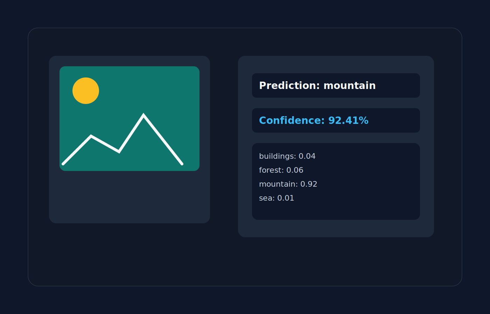

# Computer Vision Scene Classifier


A professional computer vision project for classifying outdoor scenes from images using deep learning. This repository combines image preprocessing, transfer learning with MobileNetV2, and an interactive Gradio interface for real-time scene prediction.

## Overview

This project was developed as part of a computer vision coursework and demonstrates how a convolutional neural network can be used to recognize common outdoor environments such as buildings, forests, glaciers, mountains, seas, and streets.

It includes:
- image preprocessing and feature extraction
- transfer learning using MobileNetV2
- model training and evaluation workflows
- an interactive web-based demo for prediction
- clear documentation and reusable project structure

## Key Features

- 🧠 Deep learning-based scene classification
- 📷 Supports image upload and prediction through a simple UI
- ⚡ Fast inference using MobileNetV2 pretrained weights
- 📊 Class probability outputs for interpretability
- 🧪 Includes notebooks for training and prediction workflows
- 🧰 Ready-to-use Python scripts for local demo deployment

## Project Structure

```text
.
├── Note Books/
│   ├── Bahar_CV_CCP (1).ipynb
│   ├── CV_CCp_Task_4.ipynb
│   └── CV_Prediction.ipynb
├── Cv_CCP_Images/
├── assets/
│   ├── banner.svg
│   └── demo-preview.svg
├── app.py
├── requirements.txt
├── .gitignore
└── README.md
```

## How It Works

1. An input image is uploaded or loaded from disk.
2. The image is resized and preprocessed for MobileNetV2.
3. The model predicts the most likely scene category.
4. The system returns the predicted class along with confidence scores for all available classes.
5. A Gradio interface displays the result in a user-friendly way.

## Screenshots



## Installation

### Prerequisites

- Python 3.9 or newer
- pip
- A compatible TensorFlow installation

### Install dependencies

```bash
pip install -r requirements.txt
```

## Usage

### Run the Gradio demo

```bash
python app.py
```

This will launch a local Gradio app in your browser.

### Optional: use your own trained model

If you have a trained model file, place it in the project folder or point the application to it:

```bash
MODEL_PATH="path/to/your/model.keras" python app.py
```

## Demo

Once the app is running, upload an outdoor image and the model will return:
- the predicted scene label
- confidence percentage
- probabilities for all scene classes

Example output:

```text
Prediction: mountain
Confidence: 92.41%
```

## Notebooks

The repository contains three main notebooks:
- Bahar_CV_CCP (1).ipynb — image processing and computer vision tasks
- CV_CCp_Task_4.ipynb — dataset exploration and model training workflow
- CV_Prediction.ipynb — scene prediction and interactive demo implementation

## Technologies Used

- Python
- OpenCV
- TensorFlow / Keras
- MobileNetV2
- NumPy
- Matplotlib
- Gradio
- scikit-learn
- Seaborn

## License

This project is licensed under the MIT License.

## Acknowledgements

This project was built to showcase practical computer vision and deep learning workflows for image classification.
